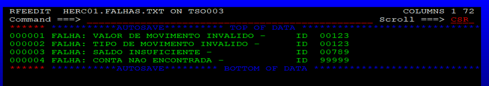
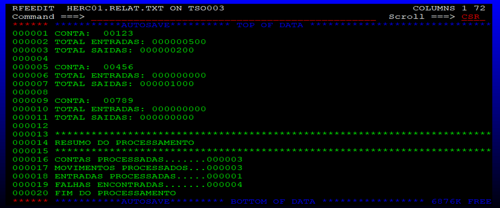

# Projeto 5 COBOL – Semana 7
## Processamento de Transações Bancárias

Projeto desenvolvido para o programa **Acelera Maker**, com o objetivo de implementar, em ambiente mainframe (z/OS via Hercules), um job JCL que ordena arquivos de clientes e transações, executa um programa COBOL responsável pelo processamento de movimentações bancárias (créditos e débitos), atualiza os saldos dos clientes e gera relatórios de execução e de erros.

---

## Cenário

Um banco precisa processar diariamente um arquivo contendo transações de débito e crédito, atualizar o saldo de cada cliente e gerar relatórios estatísticos sobre o processamento, incluindo um relatório de inconsistências encontradas.

---

## Estrutura do Projeto

| Arquivo               | Descrição                                                                 |
|-----------------------|-----------------------------------------------------------------------------|
| `PROCBC.JCL`          | Job JCL principal: compila/linka o programa COBOL, ordena os arquivos de entrada e executa o processamento. |
| `PROCESSA.CBL`        | Programa COBOL (`PROGRAM-ID. PROCESSA`), gerado como load module `CONTUPDT`, responsável pelo MATCH/MERGE entre clientes e transações. |
| `CLIENTES.TXT`        | Arquivo de entrada com o cadastro de clientes (saldo atual).                |
| `TRANSACOES.TXT`      | Arquivo de entrada com as transações (créditos/débitos) a serem aplicadas.  |
| `HERC01.CONTAS.ATUALIZ` | Arquivo de saída com o cadastro de clientes e saldos atualizados.         |
| `HERC01.RELAT.TXT`    | Relatório de totais de entradas/saídas por cliente e resumo do processamento. |
| `HERC01.FALHAS.TXT`   | Relatório de falhas/inconsistências encontradas durante o processamento.   |

---

## Layouts dos Arquivos

### Arquivo de Clientes (`CLIENTES.TXT` / `CONTAS.ATUALIZ`)

```
01 REG-CLIENTE.
   05 CLI-ID     PIC 9(05).
   05 CLI-NOME   PIC X(30).
   05 CLI-SALDO  PIC 9(09).
```

Exemplo:
```
00123JOAO SILVA                    000010000
00456MARIA SOUZA                   000025000
00789CARLOS PEREIRA                000000500
```

### Arquivo de Transações (`TRANSACOES.TXT`)

```
01 REG-TRANSACAO.
   05 CLI-ID     PIC 9(05).
   05 TRX-ID     PIC 9(05).
   05 TRX-TIPO   PIC X(01).   *> C = crédito / D = débito
   05 TRX-VALOR  PIC 9(09).
```

Exemplo:
```
0012300010C000000500
0012300020D000000200
0045600030D000001000
0078900010D000000600
9999900010C000000500
0012300010X000000500
0012300010C000000000
```

---

## Lógica de Processamento (MATCH/MERGE)

O programa `PROCESSA.CBL` lê os dois arquivos (já ordenados por `ID`) e executa um MATCH/MERGE comparando as chaves:

1. **IDs iguais** → processa a transação sobre a conta correspondente.
2. **Chave do cliente menor** → grava a conta (atualizada) na saída e no relatório, sem nenhuma transação pendente.
3. **Chave da transação menor** → cliente não existe; transação é registrada como falha (`CONTA NAO ENCONTRADA`) e ignorada.

Ao processar uma transação válida:
- **Crédito (`C`)**: soma `TRX-VALOR` ao saldo do cliente e ao total de entradas.
- **Débito (`D`)**: subtrai `TRX-VALOR` do saldo, somente se houver saldo suficiente; caso contrário, gera falha `SALDO INSUFICIENTE` e não aplica a transação.

---

## Tratamento de Erros

Todas as inconsistências são registradas em `HERC01.FALHAS.TXT`, no formato:

```
FALHA: <descrição> - ID <id>
```

| Situação                          | Condição                                            | Mensagem                                  |
|------------------------------------|-----------------------------------------------------|---------------------------------------------|
| Cliente inexistente                | Transação com `CLI-ID` não cadastrado               | `FALHA: CONTA NAO ENCONTRADA -`              |
| Tipo de transação inválido         | `TRX-TIPO` diferente de `C` ou `D`                  | `FALHA: TIPO DE MOVIMENTO INVALIDO -`        |
| Valor da transação zerado          | `TRX-VALOR` igual a zero                            | `FALHA: VALOR DE MOVIMENTO INVALIDO -`       |
| Saldo insuficiente                 | Débito deixaria o saldo negativo                    | `FALHA: SALDO INSUFICIENTE -`                |

---

## Relatórios Gerados

### Relatório de Movimentação (`HERC01.RELAT.TXT`)

Para cada cliente processado:

```
CONTA: 00123
TOTAL ENTRADAS: 000000500
TOTAL SAIDAS: 000000200
```

### Resumo do Processamento

Ao final do relatório, é exibido o resumo geral da execução:

```
****************************************
RESUMO DO PROCESSAMENTO
****************************************
CONTAS PROCESSADAS.......: 000003
MOVIMENTOS PROCESSADOS...: 000003
ENTRADAS PROCESSADAS.....: 000001
FALHAS ENCONTRADAS.......: 000004
FIM DO PROCESSAMENTO
```

---

## Estrutura do JCL (`PROCBC.JCL`)

O job `PROCBC` é composto pelos seguintes steps:

1. **COMPILAR** – Compila o programa `PROCESSA` (fonte em `HERC01.COBOL.SOURCE`) utilizando o compilador `IKFCBL00`.
2. **LINKEDIT** – Linka o objeto gerado, produzindo o load module `CONTUPDT` na biblioteca `HERC01.LOAD`.
3. **ORDCNT** – Ordena o arquivo de clientes (`HERC01.DADOS.CLIENTES`) pelo campo `ID` (posições 1-5), gerando o arquivo temporário `&&CNTSORT`.
4. **ORDMOV** – Ordena o arquivo de transações (`HERC01.DADOS.TRANSAC`) pelo campo `ID` (posições 1-5), gerando o arquivo temporário `&&MOVSORT`.
5. **EXECUTAR** – Executa o programa `CONTUPDT` (PROCESSA), consumindo os arquivos ordenados e gerando:
   - `ARQCNT` → `&&CNTSORT` (clientes ordenados)
   - `ARQMOV` → `&&MOVSORT` (transações ordenadas)
   - `CNTUPDT` → `HERC01.CONTAS.ATUALIZ` (cadastro atualizado)
   - `RELAT` → `HERC01.RELAT.TXT` (relatório de movimentação)
   - `FALHAS` → `HERC01.FALHAS.TXT` (relatório de falhas)

---

## Execução

1. Subir o ambiente Hercules/MVS e acessar o TSO.
2. Carregar os arquivos fonte (`PROCESSA.CBL`) em `HERC01.COBOL.SOURCE(PROCESSA)`.
3. Carregar os arquivos de dados (`CLIENTES.TXT` e `TRANSACOES.TXT`) em `HERC01.DADOS.CLIENTES` e `HERC01.DADOS.TRANSAC`, respectivamente.
4. Submeter o job `PROCBC.JCL` (`SUBMIT`).
5. Verificar o código de retorno (RC=0) nos steps `COMPILAR`, `LINKEDIT`, `ORDCNT`, `ORDMOV` e `EXECUTAR`.
6. Visualizar os resultados:
   - `HERC01.CONTAS.ATUALIZ` – cadastro de clientes com saldos atualizados.
   - `HERC01.RELAT.TXT` – relatório de movimentação e resumo do processamento.
   - `HERC01.FALHAS.TXT` – relatório de inconsistências encontradas.

---

## Resultado da Execução
Abaixo estão as imagens das saídas da execução do programa no ambiente TSO.

**1. Contas Atualizadas:**


**2. Erros Gerados:**


**3. Relatório:**


> **Observação**: a transação `0078900010D000000600` (débito de 600 para a conta 00789, que possui saldo de 500) gerou falha de **saldo insuficiente**, e a transação não foi aplicada — o saldo da conta 00789 permaneceu em `000000500`.

---

## Critérios de Avaliação

- **Funcionamento**: o JCL e o programa COBOL foram executados com sucesso via TSO, processando corretamente os arquivos de entrada e gerando os arquivos de saída e relatórios esperados.
- **Organização do Código**: o programa COBOL segue a estrutura de seções proposta (abertura de arquivos, leitura, MATCH/MERGE, validações, gravação de relatórios e encerramento).
- **Interatividade**: os relatórios gerados (`RELAT.TXT` e `FALHAS.TXT`) apresentam mensagens claras e objetivas sobre o processamento e as inconsistências encontradas.

---

## Tecnologias Utilizadas

- **JCL (Job Control Language)** – orquestração do job no z/OS.
- **COBOL** – lógica de processamento (compilador `IKFCBL00`).
- **SORT (DFSORT/SyncSort)** – ordenação dos arquivos de entrada.
- **Hercules** – emulador de mainframe para execução em ambiente TSO/MVS.

## Autor
Maurício Rodrigues