# Sistema de Contas Bancárias — COBOL + DB2

Projeto 6 COBOL – Semana 8 | Acelera Maker / Montreal

Sistema batch em COBOL que processa diariamente um arquivo de clientes e um arquivo de transações (débito/crédito), atualiza os saldos em tabelas DB2 e gera relatórios, logs e estatísticas de execução.

---

## Visão geral

O banco precisa processar diariamente um arquivo com as movimentações (débito e crédito) de seus clientes. Os dados cadastrais ficam armazenados em tabelas DB2 e devem ser mantidos atualizados conforme as transações são processadas.

O sistema é composto por **três programas COBOL** executados em sequência por um shell script orquestrador, que juntos:

1. Ordenam os arquivos de entrada (clientes e transações);
2. Carregam/atualizam os clientes no DB2;
3. Processam as transações aplicando as regras de negócio e atualizando os saldos;
4. Geram relatórios de processamento e detalhado, log de erros e estatísticas da execução.

---

## Arquitetura e fluxo

```
CLIENTES.TXT ─┐
              ├─► [ sort ] ─►  CLILOAD  ─►  TRXPROC ─►  RELATORIO
TRANSACOES.TXT┘                     │          │            │
                                    ▼          ▼            ▼
                               DB2: CLIENTES / TRANSACOES / ERROS_PROCESSAMENTO
                                    │          │            │
                                    ▼          ▼            ▼
                              ERROS.TXT    ERROS.TXT   RELATORIO.TXT
```

O orquestrador (`executar_job.sh`) controla a sequência **CLILOAD → TRXPROC → RELATORIO**, repassando o código de retorno (RC) mais alto entre as etapas como RC final do job, e interrompendo a cadeia caso alguma etapa retorne erro grave (RC ≥ 8).

---

## Estrutura do projeto

```
Projeto Sistema de Contas Bancárias/
├── copy/
│   ├── CLIENTE.cpy          # Layout de entrada do arquivo de clientes
│   └── TRANSACAO.cpy        # Layout de entrada do arquivo de transações
├── img/
│   ├── teste-rc00/          # Prints da execução com sucesso total (RC=0)
│   ├── teste-rc04/          # Prints da execução com atenção (RC=4)
│   └── teste-rc08/          # Prints da execução com erro grave (RC=8)
├── in/
│   ├── CLIENTES.TXT         # Arquivo de entrada de clientes
│   └── TRANSACOES.TXT       # Arquivo de entrada de transações
├── src/
│   ├── CLILOAD.sqb          # Carga/atualização de clientes no DB2
│   ├── TRXPROC.sqb          # Processamento das transações
│   ├── RELATORIO.sqb        # Geração dos relatórios
│   └── executar_job.sh      # Script orquestrador do job batch
├── Projeto 6 Cobol - Semana 8.pdf   # Enunciado do desafio
└── README.md
```

---

## Modelo de dados (DB2)

### Tabela `CLIENTES`
| Coluna | Tipo | Descrição |
|---|---|---|
| `CLI_ID` | INTEGER (PK) | Identificador do cliente |
| `CLI_NOME` | VARCHAR(30) | Nome do cliente (obrigatório) |
| `CLI_SALDO` | DECIMAL(9,0) | Saldo atual da conta |
| `DT_ATUALIZACAO` | DATE | Data da última atualização |

### Tabela `TRANSACOES`
| Coluna | Tipo | Descrição |
|---|---|---|
| `TRX_ID` | INTEGER (PK) | Identificador da transação |
| `CLI_ID` | INTEGER | Cliente associado |
| `TRX_TIPO` | CHAR(1) | `C` = Crédito / `D` = Débito |
| `TRX_VALOR` | DECIMAL(9,0) | Valor da movimentação |
| `DT_PROCESSAMENTO` | DATE | Data do processamento |

### Tabela `ERROS_PROCESSAMENTO`
| Coluna | Tipo | Descrição |
|---|---|---|
| `ID_ERRO` | INTEGER (IDENTITY) | Identificador sequencial do erro |
| `CLI_ID` | INTEGER | Cliente relacionado ao erro |
| `DESCRICAO_ERRO` | VARCHAR(100) | Descrição da falha |
| `DT_OCORRENCIA` | TIMESTAMP | Data/hora da ocorrência |

---

## Programas

### 1. `CLILOAD` — Carga de clientes
Lê `CLIENTES.TXT` (layout `CLIENTE.cpy`) e, para cada registro:
- Rejeita o cliente se o nome vier em branco (erro obrigatório);
- Verifica se o `CLI_ID` já existe na tabela `CLIENTES`:
  - **Existe** → `UPDATE` de nome, saldo e data de atualização;
  - **Não existe** → `INSERT` do novo cliente;
- Em caso de erro (negócio ou SQL), grava em `ERROS.TXT`, insere na tabela `ERROS_PROCESSAMENTO` e, se for erro SQL, executa `ROLLBACK`;
- Realiza `COMMIT` a cada 100 registros processados;
- Ao final, exibe estatísticas (lidos, inseridos, atualizados, erros, % de erro) e define o `RETURN-CODE` do programa.

### 2. `TRXPROC` — Processamento de transações
Lê `TRANSACOES.TXT` (layout `TRANSACAO.cpy`) e, para cada registro, valida em cadeia:
1. Cliente existe no DB2;
2. Tipo de transação é `C` ou `D`;
3. Valor é maior que zero;
4. Em débito, saldo é suficiente.

Se todas as validações passarem, aplica a transação (soma ou subtrai do saldo), atualiza `CLIENTES` e insere o registro em `TRANSACOES`. Qualquer falha de validação ou erro SQL é registrada em `ERROS.TXT` e na tabela `ERROS_PROCESSAMENTO`, com `ROLLBACK` em erro SQL. Assim como o `CLILOAD`, faz `COMMIT` a cada 100 registros e calcula o `RETURN-CODE` ao final.

### 3. `RELATORIO` — Relatórios e estatísticas
Consulta o DB2 diretamente (sem ler arquivos de entrada) e gera, no terminal e em `RELATORIO.TXT`:
- **Relatório de processamento**: totais de clientes cadastrados, transações processadas, créditos, débitos e erros (via `COUNT(*)`);
- **Relatório detalhado**: para cada cliente (cursor `CUR-CLIENTES`), exibe o saldo atual e lista todas as suas transações aplicadas (cursor `CUR-TRX`), atendendo ao desafio extra de uso de cursores DB2 para o relatório final.

---

## Regras de negócio

| Regra | Programa |
|---|---|
| Nome do cliente é obrigatório | CLILOAD |
| Não cadastrar cliente duplicado (verifica existência antes de inserir) | CLILOAD |
| Cliente da transação deve existir no DB2 | TRXPROC |
| Tipo de transação deve ser `C` (crédito) ou `D` (débito) | TRXPROC |
| Valor da transação deve ser maior que zero | TRXPROC |
| Débito não pode deixar o saldo negativo | TRXPROC |
| Depósito (crédito) sempre é permitido | TRXPROC |
| Saldo é sempre atualizado no DB2 após transação válida | TRXPROC |
| Transação só é gravada na tabela quando válida e aplicada | TRXPROC |

---

## Códigos de retorno (RC)

Cada programa calcula seu próprio RC ao final, com base no percentual de erros sobre o total de registros lidos:

| RC | Significado | Critério |
|---|---|---|
| **0** | Sucesso total | Nenhum erro de negócio encontrado |
| **4** | Atenção | Erros encontrados, mas dentro do limite (≤ 20%) |
| **8** | Erro grave | Erros acima do limite (> 20%) |

O script `executar_job.sh` orquestra a cadeia **CLILOAD → TRXPROC → RELATORIO**:
- Propaga o **maior RC** entre as etapas como RC final do job (`RC_MAXIMO`);
- Se `CLILOAD` ou `TRXPROC` retornar **RC ≥ 8**, o job é **abortado** e as etapas seguintes não são executadas;
- `RELATORIO` sempre executa após `TRXPROC`, caso este não tenha abortado o job, independentemente do seu RC entrar ou não no limite de atenção.

---

## Arquivos de entrada e saída

### Entrada
- **`CLIENTES.TXT`** — layout fixo `CLI-ID(5) + CLI-NOME(30) + CLI-SALDO(9)`
- **`TRANSACOES.TXT`** — layout fixo `TRX-CLI-ID(5) + TRX-ID(5) + TRX-TIPO(1) + TRX-VALOR(9)`

Exemplo:
```
CLIENTES.TXT
00123JOAO SILVA               000010000
00456MARIA SOUZA              000025000
00789CARLOS PEREIRA           000005000

TRANSACOES.TXT
0012300010C000000500
0012300020D000000200
0045600030D000001000
```

### Saída
- **`ERROS.TXT`** — log de todos os erros de negócio/SQL ocorridos no `CLILOAD` e no `TRXPROC`;
- **`RELATORIO.TXT`** — relatório de processamento + relatório detalhado por cliente, gerado pelo `RELATORIO`;
- **Tabela `ERROS_PROCESSAMENTO`** — registro persistido de cada erro no DB2.

---

## Como executar

> Pré-requisitos: ambiente com COBOL + pré-compilador SQL (DB2) configurado (ex.: TSO/z-OS ou ambiente equivalente com acesso ao `BANCODB`), além dos arquivos `CLIENTES.TXT` e `TRANSACOES.TXT` no diretório de execução.

1. **Compilar/pré-compilar** os programas `CLILOAD.sqb`, `TRXPROC.sqb` e `RELATORIO.sqb` junto com os copybooks `CLIENTE.cpy` e `TRANSACAO.cpy`, gerando os executáveis `CLILOAD`, `TRXPROC` e `RELATORIO`.
2. **Posicionar** os arquivos de entrada (`CLIENTES.TXT` e `TRANSACOES.TXT`) e os executáveis no mesmo diretório (`$HOME`).
3. **Dar permissão de execução** ao script orquestrador:
   ```bash
   chmod +x executar_job.sh
   ```
4. **Executar o job completo**:
   ```bash
   ./executar_job.sh
   ```
5. O script irá, em sequência:
   - Ordenar `CLIENTES.TXT` e `TRANSACOES.TXT`;
   - Executar `CLILOAD`, `TRXPROC` e `RELATORIO`;
   - Exibir o resumo final com o RC de cada etapa e o status geral do job (Sucesso total / Sucesso com atenção / Erro grave).
6. **Conferir as saídas** geradas: `ERROS.TXT` (se houver erros) e `RELATORIO.TXT`.

---

## Prints da execução

Abaixo estão os prints das execuções do projeto, separados por Códigos de Retorno (RC=0, RC=4, RC=8).

### Cenário RC = 0 (Sucesso total)
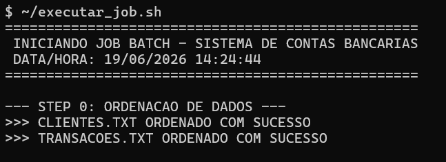
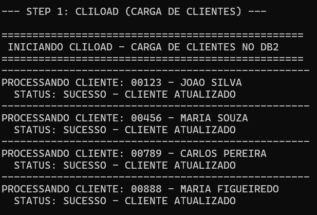
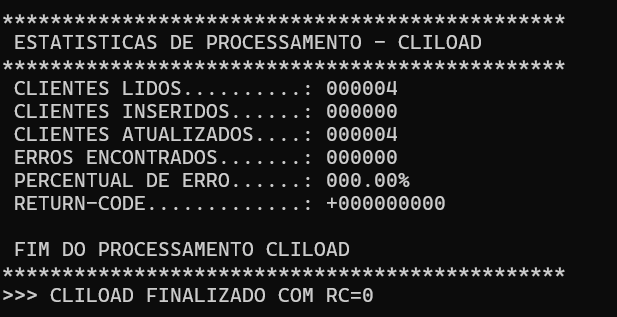
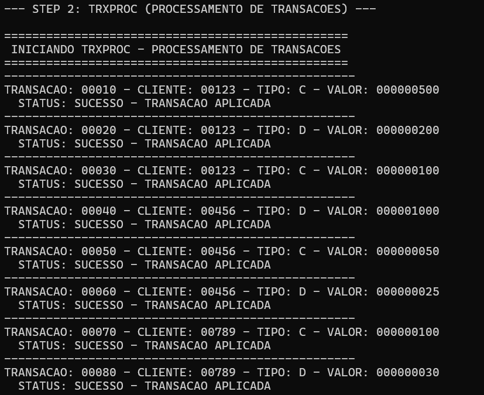
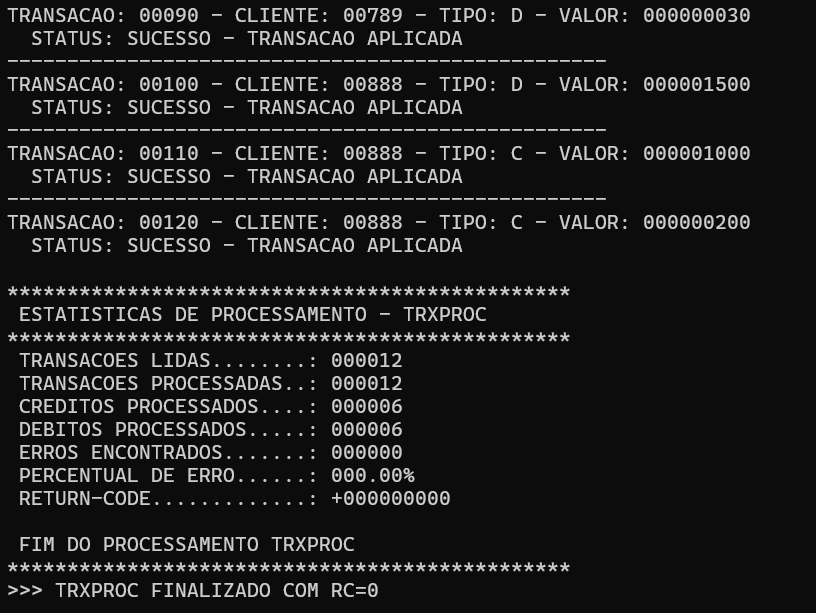
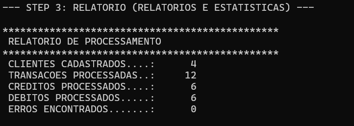
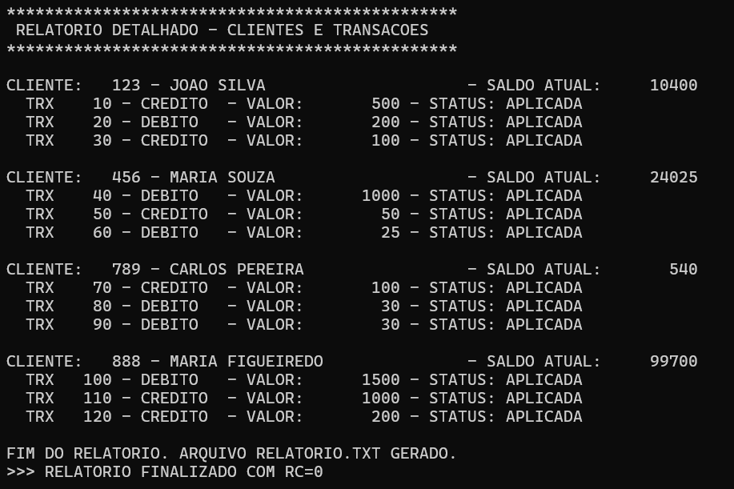
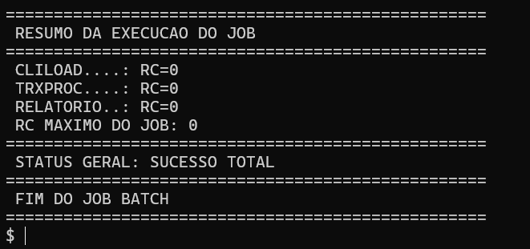

### Cenário RC = 4 (Sucesso com atenção — erros dentro do limite)
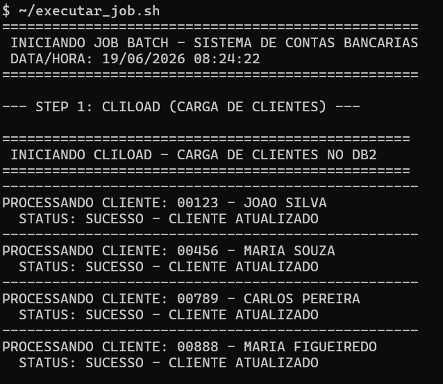
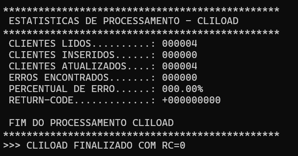
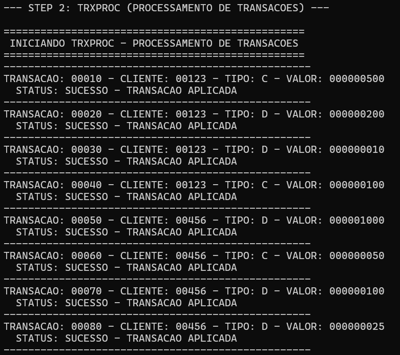
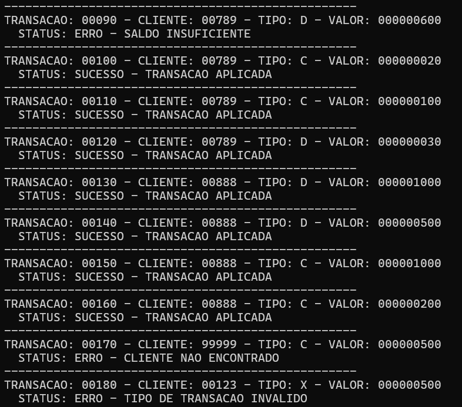
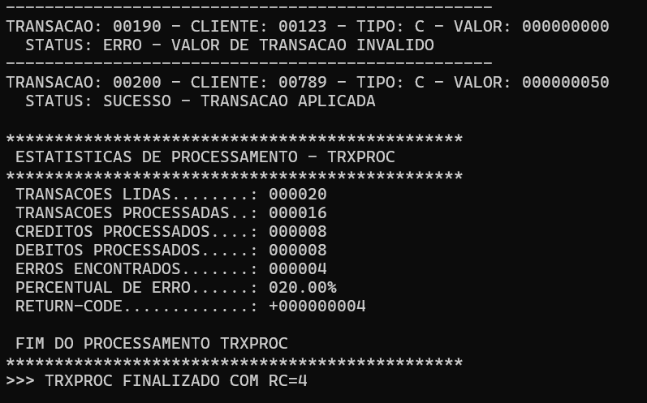
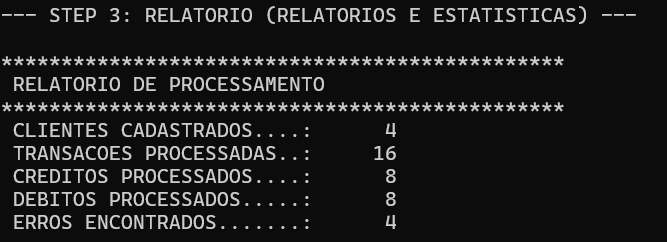
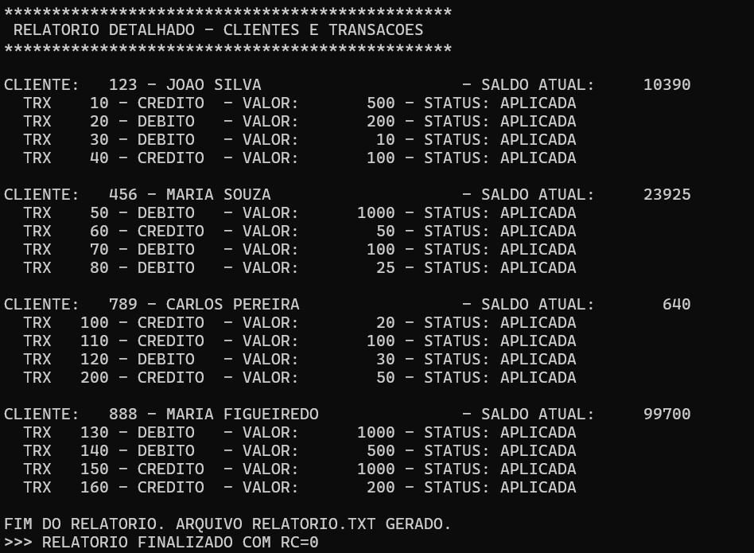
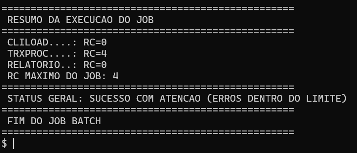

### Cenário RC = 8 (Erro grave — erros acima do limite)
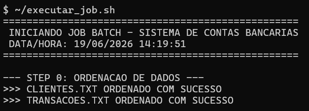
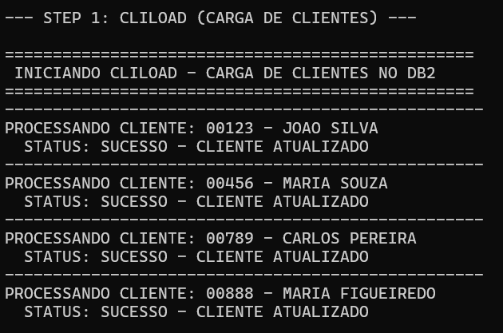
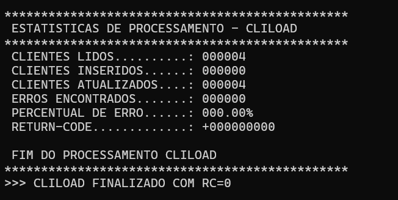
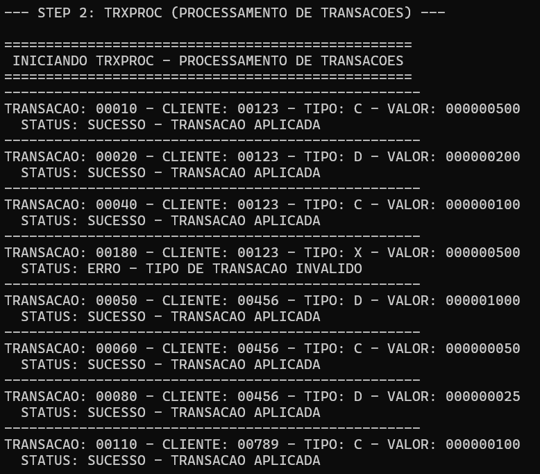
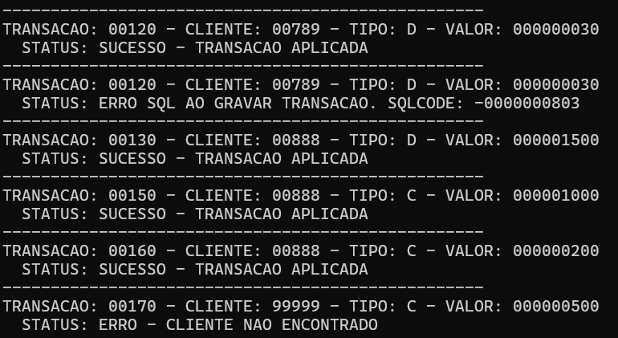
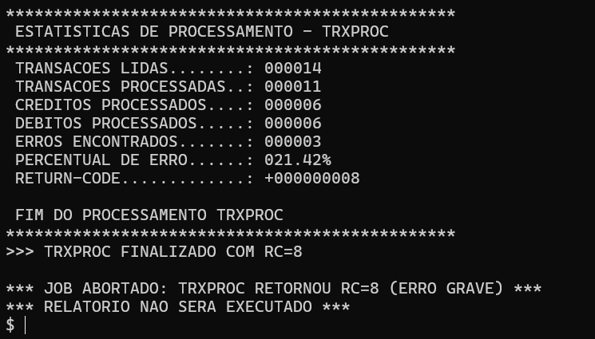

---

## Autor
Maurício Rodrigues
